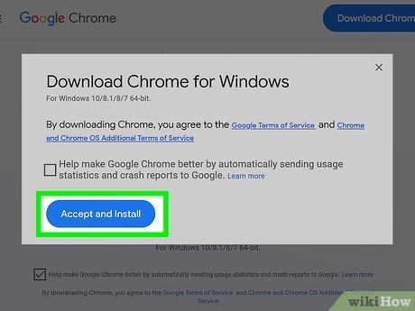

# Fitxa tècnica: Instal·lació de Google Chrome

## Objectiu

Instal·lar el navegador Google Chrome en un ordinador.

## Materials

- Ordinador
- Connexió a Internet

## Procediment

1. Obrir el navegador actual.
2. Entrar a la pàgina oficial de Google Chrome.
3. Descarregar l'instal·lador.
4. Executar l'instal·lador.
5. Esperar que finalitzi la instal·lació.

## Comprovacions

- [ ] Google Chrome s'obre correctament.
- [ ] Es pot navegar per Internet.

## Incidències i solucions

| Incidència | Solució |
|---|---|
| No es pot descarregar Chrome | Comprovar la connexió a Internet |
| Chrome no s'instal·la | Tornar a executar l'instal·lador |

## Recursos

- [Pàgina oficial de Google Chrome](https://www.google.com/chrome/)
- [Documentació de GitHub](https://docs.github.com/)
